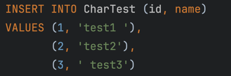
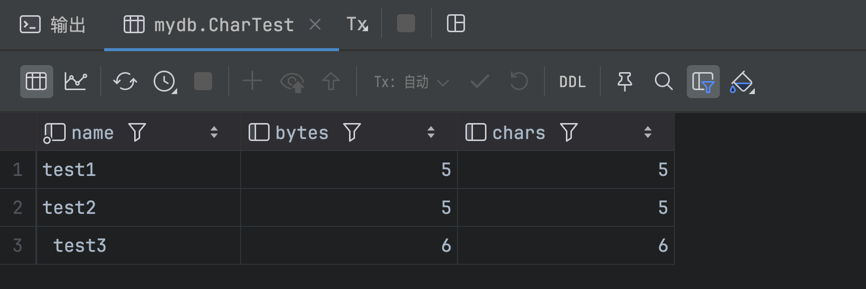
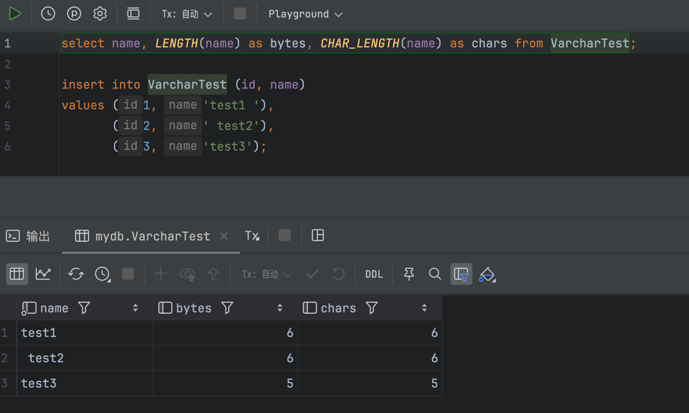

# 第6章 schema设计与管理
## 选择优化的数据类型
1、更小的通常更好。一般来说，应尽量使用能够正确存储和表示数据的最小数据类型，因为他们占用的磁盘、内存和CPU缓存的空间更少，并且处理时需要的CPU周期也更少
2、简单为好。简单数据类型的操作通常需要更少的CPU周期。
3、尽量避免存储NULL。如果查询中包含可为NULL的列，对MySQL来说更难优化。

MySQL可以为整数类型指定宽度，例如，INT(11)。这对大多数应用毫无意义：他不会限制值的合法范围，只规定了MySQL的一些交互工具用来显示字符的个数。
## 字符串类型
### varchar和char类型
下面是关于这两种类型的比较：
#### varchar
- varchar用于存储可变长度的字符串，他比char更节省空间，因为他仅使用必要的空间
- varchar需要**额外使用1或2字节记录字符串的长度**：如果列的最大长度小于或等于255字节，则只使用1字节表示，否则使用2字节。
- varchar节省了存储空间，所以对性能也有帮助。但是由于行是可变长度的，在**更新**时可能会增长，这可能会导致额外的工作。
#### char
- char是固定长度的，当存储char值时，mysql删除所有尾随空格。如果需要进行比较，值会用空格填充。
- char适合存储非常短的字符串，或者适用于**所有值的长度几乎都相同**的情况。

下面两幅图片演示了char类型实际字符数：

下面两幅图片则演示了varchar类型实际字符数：

## 日期和时间类型
### DATETIME类型和TIMESTAMP类型
#### DATETIME
这种类型可以保存大范围的数值，从1000年到9999年，精度为1微秒。他需要8字节的存储空间，且与时区无关。

#### TIMESTAMP
该类型存储自1970年1月1日GMT标准时间以来经过的秒数——与UNIX时间戳相同。它只使用4字节存储，范围比DATETIME小得多：只能表示从1970年到2038年1月19日。

需要注意的是，TIMESTAMP显示的值依赖时区，例如值为0的TIMESTAMP在美国东部标准时间（EST）中显示为1969-12-31 19:00:00，这与标准时间差5个小时。

TIMESTAMP还有DATETIME没有的特殊属性。默认情况下，当插入/更新一行记录时没有指定**第一个**TIMESTAMP列的值，MySQL会将该列的值设置为**当前时间**。

## 选择标识符
为标识符列选择合适的数据类型非常重要，下面给出了两种常见标识符列的比较：
### 整数类型
整数通常是标识符的最佳选择，因为他们速度快，并且可以总递增。
### 字符串类型
如果可能，应避免将字符串类型作为标识符的数据类型，因为他们很消耗空间，而且通常比整数类型慢。

对于完全“随机”的字符串要非常小心，如MD5(), SHA1()或UUID()生成的字符串。这些函数生成的新值会任意分布在很大的空间内，这会减慢INSERT和某些类型的SELECT的查询速度：

- 因为插入的值会写到索引的随机位置，所以会使得INSERT查询变慢。这会导致页分裂、磁盘随机访问等问题
- SELECT查询也会变慢，因为逻辑上相邻的行为广泛分布在磁盘和内存中。
- 对于所有类型的查询，随机值都会导致**缓存**的性能地下，因为他们会破坏引用的局部性。

## 特殊数据类型的处理
如果是存储通用唯一标识符（UUID），则应该删除破折号，或者更好的做法是，使用UNHEX()函数将UUID值转为16字节的数字，并将其存储在一个BINARY(16)列中

人们通常用VARCHAR(15)存储IPv4地址，但它实际上是一个32位无符号整数，而不是字符串。所以应该将IPv4地址存储为无符号整数。MySQL提供了INET_ATON()和INET_NTOA()函数在这两种表示形式之间转换。

